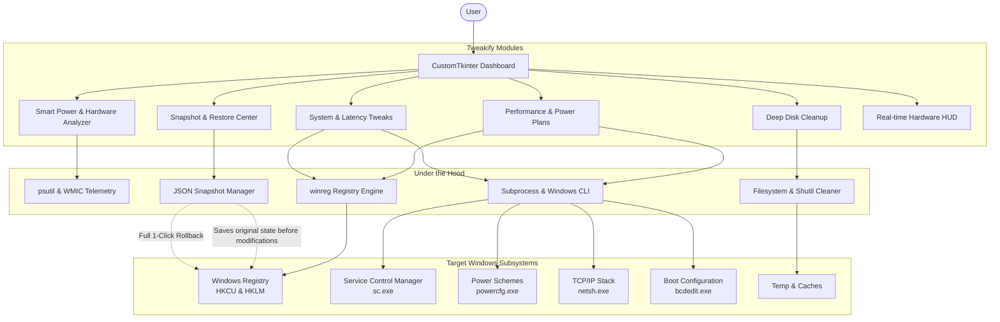

# ⚡ Tweakify — Windows Performance Suite

<div align="center">


-0078d4?style=for-the-badge&logo=windows)


**A professional, open-source Windows performance optimization suite and hardware analyzer.**  
*Smart Power Profiling · One-Click Deep Cleanup · System Tweaks · RAM Optimization · Full Snapshot Rollback*

[⬇️ Download Installer](https://github.com/abdllaouidjabere-cmyk/Tweakify/releases/latest) &nbsp;•&nbsp; [🌐 Official Website](https://tweakify.site/) &nbsp;•&nbsp; [📖 Documentation](#-features) &nbsp;•&nbsp; [🐛 Report Issue](https://github.com/abdllaouidjabere-cmyk/Tweakify/issues)

</div>

---

## 📑 Table of Contents

- [Overview](#-overview)
- [Key Modules & Features](#-key-modules--features)
  - [1. Smart Power Plan & Hardware Analyzer](#1--smart-power-plan--hardware-analyzer)
  - [2. Performance & Power Management](#2--performance--power-management)
  - [3. Deep System Cleanup](#3--deep-system-cleanup)
  - [4. Surgical System Tweaks](#4--surgical-system-tweaks)
  - [5. Snapshot & Safety Rollback](#5--snapshot--safety-rollback)
  - [6. System Specifications & Telemetry](#6--system-specifications--telemetry)
- [Architecture & How It Works](#-architecture--how-it-works)
- [Getting Started](#-getting-started)
  - [System Requirements](#system-requirements)
  - [Installation & Portable Run](#installation--portable-run)
- [Build From Source](#-build-from-source)
- [Project Directory Structure](#-project-directory-structure)
- [Safety, Privacy & Registry Disclosures](#-safety-privacy--registry-disclosures)
- [Contributing](#-contributing)
- [License](#-license)
- [Disclaimer](#-disclaimer)

---

## 🌟 Overview

**Tweakify** is a standalone, modern Windows utility built with Python and `customtkinter` designed for gamers, developers, and power users who want maximum PC responsiveness without executing unknown batch files or dangerous registry hacks.

Unlike typical registry scripts, Tweakify features an **intelligent hardware analyzer** that scores your computer's specs in real time, recommends optimal power schemes, and safeguards every change behind an automated **JSON snapshot and restore mechanism**.

```
┌────────────────────────────────────────────────────────────────────────┐
│  ⚡ TWEAKIFY v2.0 PRO                     [CPU: 14%]  [RAM: 42%]        │
├────────────────────────────────────────────────────────────────────────┤
│  [🤖 Smart Power] [🚀 Performance] [🧹 Cleanup] [🔧 Tweaks] [♻️ Restore]│
│                                                                        │
│  • Hardware Score: 85/100                                              │
│  • Recommended: 🏎️ Ultimate Performance                                │
│  • Components: 8 Physical Cores | 32GB RAM | RTX 4070 Dedicated GPU    │
│  • Auto-Snapshot: Protected & 100% Reversible                          │
├────────────────────────────────────────────────────────────────────────┤
│  📡 Live Log: [03:25:12] Snapshot saved successfully.                   │
└────────────────────────────────────────────────────────────────────────┘
```

---

## ✨ Key Modules & Features

### 1. 🤖 Smart Power Plan & Hardware Analyzer
- **Component Scoring (0–100)**: Evaluates CPU core count, frequencies, installed memory, dedicated VRAM, and GPU architecture.
- **Intelligent Classification**: Detects gaming rigs, mobile laptops, or server-class processors.
- **Thermal & Battery Safety Awareness**: Detects running on battery power or elevated CPU temperatures (>85°C) to prevent overheating or rapid battery drain.
- **Custom Hardware Bars**: Visual indicators for CPU, RAM, and GPU contribution scores.
- **Recommended Plan Application**: Automatically suggests and activates either **Ultimate Performance**, **High Performance**, **Balanced**, or **Power Saver**.

### 2. 🚀 Performance & Power Management
- **One-Click Power Scheme Switching**:
  - `🏎️ Ultimate Performance` (`e9a42b02-d5df-448d-aa00-03f14749eb61`)
  - `⚡ High Performance` (`8c5e7fda-e8bf-4a96-9a85-a6e23a8c635c`)
  - `⚖️ Balanced` (`381b4222-f694-41f0-9685-ff5bb260df2e`)
  - `🔋 Power Saver` (`a1841308-3541-4fab-bc81-f71556f20b4a`)
- **Service Manager**: Instant control (Stop & Disable / Enable & Start) for known resource hogs:
  - `SysMain` (formerly SuperFetch)
  - `DiagTrack` (Connected User Experiences and Telemetry)
  - `wuauserv` (Windows Update service)
  - `XblAuthManager` (Xbox Live Authentication)
- **Memory Optimization**:
  - Automatically terminates unresponsive and frozen applications.
  - Flushes system working sets using `ProcessIdleTasks`.
  - Adjusts background non-critical process priority classes to prevent system stutter.

### 3. 🧹 Deep System Cleanup
Reclaims gigabytes of disk space with granular checkbox controls and live freed-space metrics:
- 🗑️ **User Temp Files**: Clears `%TEMP%` cache.
- 🗑️ **Windows Temp Files**: Clears `C:\Windows\Temp`.
- ⚡ **Prefetch Files**: Removes obsolete prefetch cache from `C:\Windows\Prefetch`.
- ♻️ **Recycle Bin**: Empties all drives' recycle bins via system commands.
- 🌐 **Browser Cache**: Detects and purges cache for **Google Chrome**, **Microsoft Edge**, and **Mozilla Firefox**.
- 📋 **Event Logs**: Clears accumulated Windows event logs using `wevtutil`.
- 🔄 **Windows Update Cache**: Stops `wuauserv` and cleans `SoftwareDistribution\Download`.
- 🖼️ **Thumbnail Cache**: Wipes corrupted or bloated `thumbcache_*.db` files.

### 4. 🔧 Surgical System Tweaks
- 🎞️ **Disable Animations**: Eliminates window minimization and opening delays (`MinAnimate` = 0, `VisualFXSetting` = 2).
- 💎 **Disable Transparency**: Disables taskbar and window transparency for reduced GPU/DWM overhead (`EnableTransparency` = 0).
- ⚡ **Enable Fast Startup**: Activates hybrid boot for faster boot sequences (`HiberbootEnabled` = 1).
- 🤫 **Disable Cortana**: Suppresses Cortana background processes via search policies (`AllowCortana` = 0).
- 🎮 **Enable Game Mode**: Activates Windows Game Mode and Game Bar optimizations (`AutoGameModeEnabled` = 1).
- ⏱️ **Timer Resolution Tuning**: Configures platform ticks via `bcdedit` (`useplatformtick yes`) to reduce input lag.
- 🌐 **Network Optimization**: Fine-tunes TCP autotuning (`autotuninglevel=normal`), enables RSS & DCA, disables heuristics, and sets `TcpAckFrequency=1` for minimal ping.
- 🔍 **Disable Search Indexing**: Stops and disables `WSearch` background indexing to relieve disk I/O.

### 5. ♻️ Snapshot & Safety Rollback
- **Pre-execution Auto-Snapshot**: Tweakify automatically creates an exact snapshot of registry keys, service states, and active power schemes before modifying anything.
- **Manual Snapshot Trigger**: Users can take custom snapshots on demand.
- **Complete Reversal**: Restores registry values, restarts services to their original startup types, re-engages power plans, and rolls back network and timer parameters.
- **Safe Dialog Guard**: Requires interactive confirmation to avoid accidental reversions.

### 6. 📊 System Specifications & Telemetry
- **Header HUD**: Real-time CPU and RAM percentage meters with dynamic color warnings (Green / Orange / Red).
- **Comprehensive Hardware Inspector**:
  - Windows version, OS build, and architecture
  - CPU model, core breakdown (physical vs. logical), and active clock frequency
  - Total and consumed RAM with percentage display
  - Drive C: total capacity and free space
  - System boot time and calculated uptime
  - Machine hostname and current user profile
- **Timestamped Console Log**: Every action, success, or warning is logged in an integrated, scrollable terminal.

---

## 🛠️ Architecture & How It Works



### Technical Subsystem Interactions

| Subsystem | Tool / API | Keys / Parameters Modified |
|---|---|---|
| **Visual FX** | `winreg` | `HKCU\Control Panel\Desktop\WindowMetrics\MinAnimate`<br>`HKCU\Software\Microsoft\Windows\CurrentVersion\Explorer\VisualEffects` |
| **Transparency** | `winreg` | `HKCU\SOFTWARE\Microsoft\Windows\CurrentVersion\Themes\Personalize\EnableTransparency` |
| **Power Management** | `powercfg` | Schemes: Ultimate, High Performance, Balanced, Power Saver |
| **Services** | `sc.exe` | `SysMain`, `DiagTrack`, `wuauserv`, `XblAuthManager`, `WSearch` |
| **Network & Latency**| `netsh` / `winreg` | `TcpAckFrequency`, `autotuninglevel`, `rss`, `dca`, `ecncapability` |
| **Boot & Timers** | `bcdedit` / `winreg` | `useplatformtick`, `HiberbootEnabled` |
| **Privacy / Cortana**| `reg.exe` | `HKLM\SOFTWARE\Policies\Microsoft\Windows\Windows Search\AllowCortana` |

---

## 📦 Getting Started

### System Requirements

- **Operating System**: Windows 10 or Windows 11 (64-bit recommended)
- **Privileges**: Administrator permissions (Tweakify prompts for UAC elevation automatically upon launch)
- **Dependencies**: None when using the pre-compiled `.exe` installer or standalone release

### Installation & Portable Run

| Package | Type | Description |
|---|---|---|
| **`Tweakify_Setup_v2.0.exe`** | Setup Wizard | Standard installer with desktop shortcut and uninstaller (created with Inno Setup) |
| **`Tweakify.exe`** | Portable | Standalone single-file executable; zero installation needed |

> 💡 **Tip**: Simply right-click and select **Run as Administrator** (or allow the UAC prompt).

---

## 🔨 Build From Source

To run Tweakify directly from Python source or compile your own standalone binaries:

### 1. Clone Repository & Setup Environment
```bash
git clone https://github.com/abdllaouidjabere-cmyk/Tweakify.git
cd Tweakify

# (Optional) Create and activate virtual environment
python -m venv venv
venv\Scripts\activate
```

### 2. Install Required Dependencies
```bash
pip install customtkinter psutil pyinstaller
```

### 3. Run Directly with Python
```bash
python main.py
```

### 4. Build Standalone Executable (PyInstaller)
Compile a single windowed `.exe` with the bundled `customtkinter` assets and icon:
```bash
pyinstaller --noconfirm --onefile --windowed --name "Tweakify" --icon "icon.ico" --collect-all customtkinter main.py
```
The output executable will be created in `dist/Tweakify.exe`.

### 5. Build Installer (Optional - Inno Setup)
If you have [Inno Setup](https://jrsoftware.org/isdl.php) installed:
```bash
iscc setup.iss
```
This generates `Output/Tweakify_Setup_v2.0.exe`.

---

## 📁 Project Directory Structure

```
Tweakify/
├── main.py              # Core application logic, GUI tabs & hardware analyzer
├── icon.ico             # Application branding icon
├── setup.iss            # Inno Setup 6 installer script
├── Tweakify.spec        # PyInstaller build specification
├── README.md            # Comprehensive project documentation
├── website/             # Official promotional landing page & download site
│   ├── index.html       # Landing page structure with interactive modals
│   ├── style.css        # Cyberpunk / Dark modern stylesheet
│   ├── script.js        # Dynamic particle canvas, metrics & download tracking
│   ├── api.php          # Backend registration / analytics endpoint
│   └── sitemap.xml      # SEO sitemap
├── dist/                # Output folder for compiled binaries
│   └── Tweakify.exe     # Compiled portable executable
└── build/               # Intermediate build artifacts
```

---

## 🛡️ Safety, Privacy & Registry Disclosures

- **100% Free & Open Source**: No obfuscated code, no hidden miners, no adware.
- **No Remote Telemetry**: Tweakify does not collect or transmit your personal data.
- **Automated Rollback Snapshot**: System parameters are logged to `tweakify_snapshot.json` in your temporary directory prior to executing any modifications.
- **Reversible Tweaks**: Every registry tweak is paired with a corresponding restoration routine.

---

## 🤝 Contributing

Contributions, issues, and feature proposals are warmly welcomed!

1. Fork the Project
2. Create your Feature Branch:
   ```bash
   git checkout -b feature/NewAwesomeFeature
   ```
3. Commit your Changes:
   ```bash
   git commit -m "Add: New reversible gaming tweak"
   ```
4. Push to the Branch:
   ```bash
   git push origin feature/NewAwesomeFeature
   ```
5. Open a Pull Request

**Rules for Contributions:**
- Any newly proposed tweak must be reversible and incorporated into `SystemSnapshot`.
- All operations must output human-readable messages to `self.log()`.
- Code should remain compatible with both Windows 10 and Windows 11.

---

## ⚖️ License

Distributed under the **MIT License**. See `LICENSE` for details. You are free to modify, distribute, and integrate this software into your own workflows.

---

## ⚠️ Disclaimer

Tweakify modifies Windows system settings, services, and registry values to maximize performance. While the built-in snapshot manager provides one-click restoration, always create a Windows System Restore point before performing system-wide tuning. The authors are not liable for any unintended configuration conflicts.

---

<div align="center">

Made with ⚡ by **Jaber** &nbsp;•&nbsp; Free & Open Source Forever

</div>
